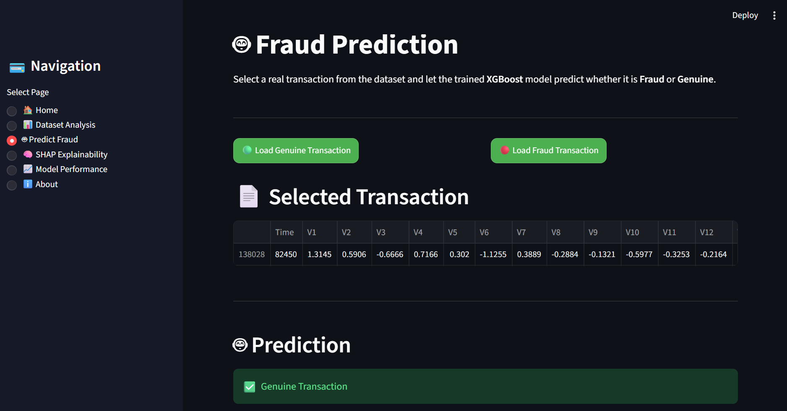
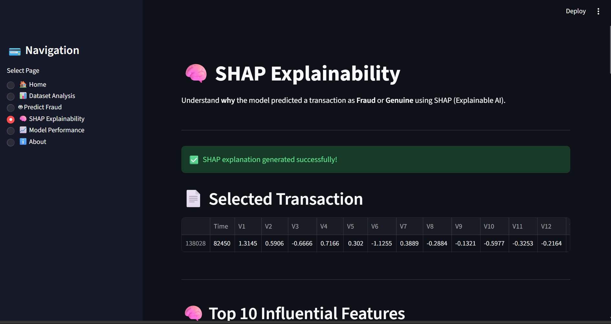
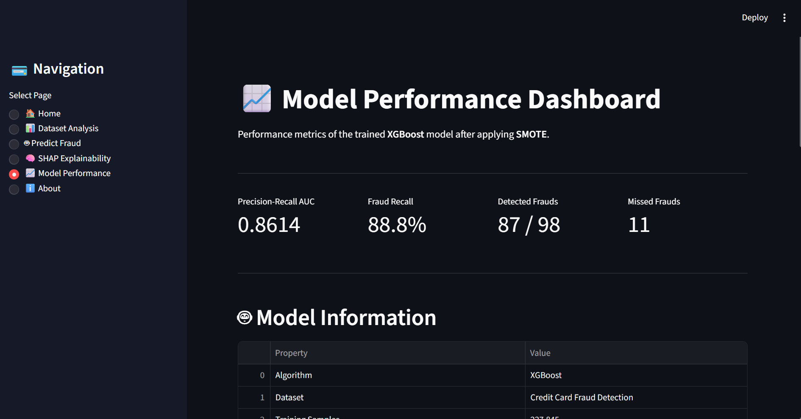
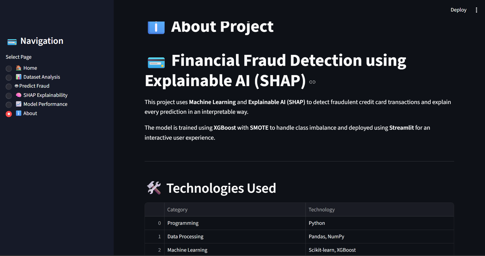

# 💳 Financial Fraud Detection using Explainable AI (SHAP)

An end-to-end Machine Learning project that detects fraudulent credit card transactions using **XGBoost** and explains every prediction using **SHAP (Explainable AI)**.

Built with **Python**, **Streamlit**, **XGBoost**, **SHAP**, and **SMOTE**.
## 📌 Project Overview

Financial fraud is a major challenge in digital banking due to highly imbalanced transaction data.

This project builds an end-to-end fraud detection system using Machine Learning and Explainable AI.

The application provides:

- Fraud Prediction
- Dataset Analysis
- Model Performance
- SHAP Explainability
- Interactive Streamlit Dashboard

## ✨ Features

- 📊 Dataset Analysis
- 🤖 Fraud Prediction
- 🧠 SHAP Explainability
- 🌊 SHAP Waterfall Plot
- 📈 Model Performance Dashboard
- 🚀 Interactive Streamlit Application
- 💳 Credit Card Fraud Detection

## 🛠️ Tech Stack

### Programming

- Python

### Data Processing

- Pandas
- NumPy

### Machine Learning

- Scikit-learn
- XGBoost
- SMOTE

### Explainable AI

- SHAP

### Visualization

- Matplotlib
- Plotly

### Deployment

- Streamlit

## 📂 Project Structure

Financial-Fraud-Detection/

├── app/
│   └── app.py
│
├── data/
│   └── creditcard.csv
│
├── models/
│   └── fraud_model.pkl
│
├── reports/
│   ├── shap_summary_plot.png
│   ├── shap_feature_importance.png
│   ├── shap_waterfall_plot.png
│   ├── force_plot.html
│   └── screenshots/
│
├── src/
│   ├── fraud_detection.py
│   └── shap_analysis.py
│
├── README.md
├── requirements.txt
└── .gitignore

## 🤖 Machine Learning Pipeline

1. Load the Credit Card Fraud Detection dataset.
2. Perform Exploratory Data Analysis (EDA).
3. Split the dataset into training and testing sets.
4. Apply SMOTE to handle class imbalance.
5. Train an XGBoost classifier.
6. Evaluate the model using Precision-Recall AUC and Confusion Matrix.
7. Explain predictions using SHAP.
8. Deploy the model using Streamlit.
## 🏗️ Project Architecture

```text
Credit Card Dataset
        │
        ▼
Data Preprocessing
        │
        ▼
Exploratory Data Analysis
        │
        ▼
SMOTE
        │
        ▼
XGBoost Model
        │
        ▼
Fraud Prediction
        │
        ▼
SHAP Explainability
        │
        ▼
Streamlit Dashboard
```
## 📈 Model Performance

| Metric | Value |
|---------|------:|
| Algorithm | XGBoost |
| Precision-Recall AUC | 0.8614 |
| Fraud Recall | 88.8% |
| Fraud Cases Detected | 87 / 98 |
| Missed Fraud Cases | 11 |
| Explainability | SHAP |

## 🧠 Explainable AI (SHAP)

The project uses SHAP (SHapley Additive exPlanations) to improve model transparency.

### Global Explainability

- SHAP Summary Plot
- Feature Importance Plot

### Local Explainability

- Waterfall Plot
- Force Plot

These visualizations explain why the model classified a transaction as Fraud or Genuine.

# 💳 Financial Fraud Detection using Explainable AI (SHAP)

... (Overview)

## 📸 Dashboard Screenshots

### 🏠 Home


---

### 📊 Dataset Analysis


---

### 🤖 Fraud Prediction



---

### 🧠 SHAP Explainability



---

### 📈 Model Performance



---

### ℹ️ About


